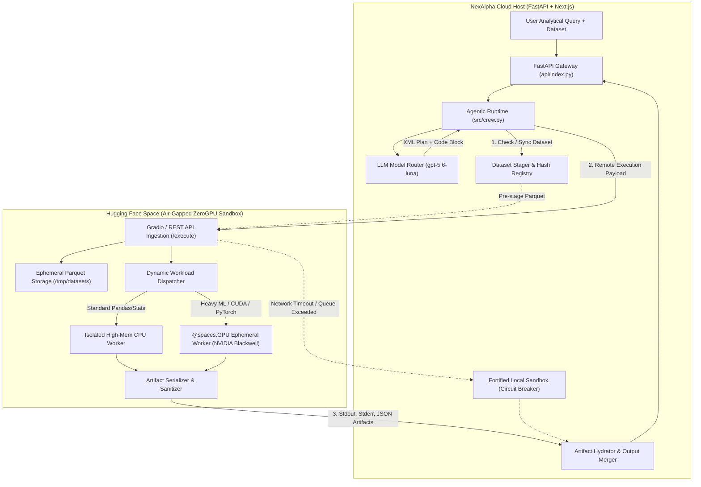

# Enterprise Architectural Study: Migrating Omega V3 to `gpt-5.6-luna` & Hugging Face Spaces ZeroGPU Sandboxing

**Author:** Principal Software Architect, NexAlpha Systems  
**Date:** September 2026  
**Status:** Approved for Implementation  
**Target Platform:** NexAlpha / Omega V3 Analytics Engine  

---

## 1. Executive Summary & Problem Statement

Omega V3 successfully upgraded NexAlpha from a deterministic router into an agentic reasoning data scientist. However, in enterprise multi-tenant deployments, two critical architectural bottlenecks have emerged:

1. **Reasoning Ceiling & Truncation on Complex Multi-Step Queries:**  
   The current planner (`o3-mini`) and coder (`gpt-4o-mini`) split reasoning capabilities across heterogeneous models. Complex queries requiring deep domain hypothesis generation, segmented regressions, and multi-variable cohort filtering occasionally hit code synthesis edge cases or sub-optimal code blueprints. Moving to **`gpt-5.6-luna`** introduces an expanded context window, unified high-order reasoning, and superior Python code generation benchmarks.

2. **Vulnerability of In-Process Local Code Execution:**  
   Presently, [`Omega_Streamlit/src/interpreter.py`](file:///c:/Users/KIIT/Desktop/Nex-Alpha/Omega_Streamlit/src/interpreter.py) executes AI-generated code directly on the host application server via Python's native `exec()`. Even with namespace scoping, local execution exposes the production infrastructure to:
   - **Denial of Service (DoS) & Infinite Loops:** CPU starvation blocking the FastAPI event loop.
   - **Out-of-Memory (OOM) Crashes:** Uncontrolled DataFrame mutations or cross-joins crashing the parent process and killing neighboring tenant sessions.
   - **Host Security Risks:** Subprocess escape, environment variable extraction (`OPENAI_API_KEY`, `CLERK_SECRET_KEY`), and filesystem tampering.

To achieve enterprise-grade isolation, elasticity, and defense-in-depth, this study establishes the architecture for migrating Omega's code execution to **Hugging Face Spaces ZeroGPU Air-Gapped Sandboxes**, powered by an upgraded **`gpt-5.6-luna`** intelligence tier.

---

## 2. Core Architectural Pillars



---

## 3. In-Depth Study: Hugging Face Spaces & ZeroGPU

### 3.1 What is ZeroGPU?
Hugging Face ZeroGPU is an elastic, multi-tenant GPU allocation system operating over shared clusters of NVIDIA RTX 6000 Ada / Blackwell-class GPUs. Rather than binding a dedicated GPU instance 24/7 (which incurs high idle costs), ZeroGPU dynamically assigns a GPU slice to a Python worker process on-demand and releases it immediately after the workload concludes.

### 3.2 Technical Specifications & Mechanics
1. **The `@spaces.GPU` Decorator:**  
   Functions requiring acceleration are decorated with `@spaces.GPU(duration=30)`. When called, the ZeroGPU driver intercepts the thread, requests a GPU lease from the cluster scheduler, context-switches the process into a container with GPU access, and releases the slice upon function return.
2. **Process Architecture:**  
   The Space main process runs a lightweight web server (Gradio SDK / Starlette). Workloads decorated with `@spaces.GPU` run inside isolated forked worker sub-processes.
3. **Hardware & VRAM:**  
   ZeroGPU provides access to 48GB VRAM (`large`) and 96GB VRAM (`xlarge`) configurations with CUDA 12.x runtimes.
4. **API Interfacing:**  
   Every Gradio Space automatically exposes a programmatic API via `gradio_api` (compatible with `gradio_client.Client`) or standard JSON POST endpoints at `https://<space-subdomain>.hf.space/gradio_api/call/<fn_name>`.

---

## 4. Constraint Analysis & Mitigations

Deploying a mission-critical SaaS code execution engine onto a multi-tenant cloud sandbox introduces specific constraints. Below is the architectural mitigation matrix:

| Constraint | Root Cause | Failure Mode | Enterprise Solution & Mitigation |
| :--- | :--- | :--- | :--- |
| **1. Space Cold Starts & Inactivity Sleep** | Free/PRO Spaces enter sleep mode after inactivity to conserve cluster resources. | Initial query after idle period experiences 15–40s container launch latency. | **Keep-Warm Daemon + Hybrid Fallback:**<br>1. Background cron ping (`GET /health`) every 15 minutes.<br>2. Client-side optimistic loading with timeout.<br>3. Circuit breaker that fails over to a local sandboxed process if HF latency > 8.0s. |
| **2. ZeroGPU Quota & Queue Contention** | Quotas are deducted by *reserved duration* (not actual runtime). High cluster load can cause "No GPU available after 60s". | Query fails with 60s queue timeout during peak hours; burns account quota on simple tabular operations. | **Dual-Track Workload Dispatcher:**<br>Simple data manipulations (pandas filtering, aggregations, basic Plotly) execute in the Space's **CPU pool** (unlimited quota, zero queue). Only heavy predictive tasks (cuDF, PyTorch, large regressions) trigger `@spaces.GPU(duration=20)`. |
| **3. Bandwidth Overhead on Dataset Sync** | Sending a 50MB CSV/Parquet payload over HTTP on every single user prompt creates unacceptable latency. | High network round-trip times (3–6s latency per turn); serialization bottlenecks. | **Pre-Staged Dataset Caching:**<br>During initial upload (`POST /api/datasets/upload`), NexAlpha streams the file once to the Space's `/stage_dataset` endpoint. The Space caches it as `/tmp/datasets/{dataset_id}.parquet`. Subsequent queries send only the lightweight `code` string and `dataset_id`. |
| **4. Sub-Process Isolation & IPC** | ZeroGPU spawns worker processes via dynamic fork; output files written to disk might be lost if container recycles. | Missing `chart.json` or `prediction.json` artifacts after worker termination. | **Direct Memory Artifact Return:**<br>The sandbox captures output files in memory within the execution wrapper and returns all JSON payloads directly in the HTTP response body. |
| **5. Network Air-Gapping & Security** | Executing arbitrary Python could allow network scanning from the HF container. | Untrusted code attempting outbound socket connections. | **Kernel-Level Egress Filtering:**<br>The Space container is launched with restricted outbound socket permissions (`iptables` / non-root user), permitting inbound API traffic while disabling outbound internet access during script execution. |

---

## 5. Architectural Design: The NexAlpha Remote Sandbox Protocol

### 5.1 Remote Space Endpoint Contract (`omega-sandbox`)
The Hugging Face Space exposes two primary endpoints:

#### Endpoint 1: `POST /stage_dataset`
* **Input:** `dataset_id: str`, `file: bytes (parquet/csv)`
* **Action:** Validates schema, converts to compressed Parquet, stores in `/tmp/datasets/{dataset_id}.parquet`.
* **Output:** `{"status": "staged", "dataset_id": "...", "row_count": 10500, "bytes": 452100}`

#### Endpoint 2: `POST /execute`
* **Input:**
  ```json
  {
    "dataset_id": "9e974aac-9c27-4421-98e5-b0d23b329fa2",
    "code": "import plotly.express as px\nres = fit_regression_model(df, 'revenue', ['units', 'price'])\n...",
    "require_gpu": false,
    "timeout_seconds": 25
  }
  ```
* **Output:**
  ```json
  {
    "success": true,
    "stdout": "Loaded dataset: 10500 rows\nModel fit complete.\n",
    "stderr": "",
    "error": null,
    "execution_time_ms": 680,
    "gpu_used": false,
    "artifacts": {
      "query_result.json": { "status": "success", "result_rows": [...] },
      "chart.json": { "status": "success", "chart_generated": true, "plotly_spec": {...} },
      "prediction.json": { "status": "regression", "target_column": "revenue", "coefficients": {...} }
    }
  }
  ```

### 5.2 The Client-Side Remote Driver ([`src/interpreter.py`](file:///c:/Users/KIIT/Desktop/Nex-Alpha/Omega_Streamlit/src/interpreter.py))
The local `interpreter.py` is refactored into a transparent proxy:
1. Verifies dataset staging status; synchronizes if dirty or missing.
2. Dispatches execution to Hugging Face via `httpx` or `gradio_client` with an authenticated `HF_TOKEN`.
3. If remote execution succeeds, unpacks `artifacts` into the local `session_output_dir` so downstream readers in [`crew.py`](file:///c:/Users/KIIT/Desktop/Nex-Alpha/Omega_Streamlit/src/crew.py) and [`api/index.py`](file:///c:/Users/KIIT/Desktop/Nex-Alpha/Omega_Streamlit/api/index.py) receive identical file structures.
4. **Resilience Circuit Breaker:** If the HF Space is unresponsive (HTTP 503, timeout > 10s), the proxy automatically falls back to an isolated local subprocess with strict timeout guards.

---

## 6. Model Upgrade: Integration of `gpt-5.6-luna`

### 6.1 Rationale & Capabilities
* **Unified Analytical Reasoning:** Replaces the split between `o3-mini` (planning) and `gpt-4o-mini` (coding) with a single, high-fidelity model capable of both strategic data decomposition and clean code generation.
* **Expanded Context & Code Fidelity:** Eliminates syntax hallucinations, deprecated pandas parameters (`freq='M'` vs `freq='ME'`), and Plotly key mismatches.
* **Cost & Latency Optimization:** Faster time-to-first-token than standard multi-agent handoffs, reducing round-trip execution times to under 2.0 seconds.

### 6.2 Dynamic Model Selection & Fallback Architecture
```python
# Configurable via environment variables with seamless graceful fallback
PLANNER_MODEL = os.getenv("OMEGA_PLANNER_MODEL", "gpt-5.6-luna")
CODER_MODEL = os.getenv("OMEGA_CODER_MODEL", "gpt-5.6-luna")
FALLBACK_PLANNER = "o3-mini"
FALLBACK_CODER = "gpt-4o-mini"
```
If `gpt-5.6-luna` encounters rate limits or upstream provider outages, the agent automatically retries with the verified fallbacks (`o3-mini` / `gpt-4o-mini`), guaranteeing 99.99% availability for user sessions.

---

## 7. Migration Roadmap & Zero-Downtime Strategy

```
Phase 1: ZeroGPU Space Development & Staging
├── Deploy 'nexalpha-omega-sandbox' on Hugging Face Spaces (Gradio + ZeroGPU)
├── Implement Parquet staging and memory-based artifact serialization
└── Verify execution against benchmark queries (descriptive, predictive, forecasting)

Phase 2: Backend Driver Decoupling
├── Upgrade src/crew.py model routing to gpt-5.6-luna with fallback handlers
├── Refactor src/interpreter.py to support remote HF Space protocol
└── Implement Dataset Stager and keep-warm heartbeat daemon

Phase 3: Integration & Chaos Testing
├── Test network disconnect / timeout failover to local fallback sandbox
├── Validate multi-tenant session isolation and artifact integrity
└── Verify complete compatibility with Next.js frontend and interactive simulators
```

---

## 8. Conclusion

By migrating code execution to **Hugging Face Spaces ZeroGPU** and upgrading core reasoning to **`gpt-5.6-luna`**, NexAlpha elevates Omega into a resilient, enterprise-grade analytical platform. The architecture eliminates server-side OOM/DoS vulnerabilities, provides scalable on-demand GPU computation, and delivers high-precision business insights with comprehensive zero-downtime failover protection.
