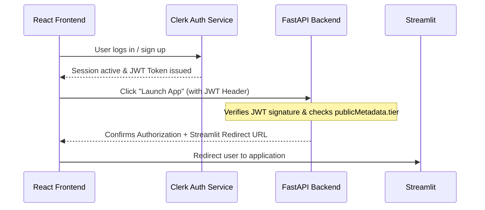

# NexAlpha Full-Stack Platform: Implementation Plan

This plan outlines the architecture, setup, and code structures required to build **NexAlpha**—a premium landing page showcasing **Omega** (AI Analytics Platform) and **OptiTrade** (AI Options Trading Assistant) with user authentication, subscription plans, animations, and a FastAPI backend.

---

## Technical Stack Overview

We will align exactly with your course structure:
1. **Frontend**: Next.js (React with Pages Router, TypeScript, Tailwind CSS, Framer Motion for premium animations).
2. **Backend**: Python FastAPI (handling authentication check and routing redirection).
3. **Authentication**: **Clerk** (user accounts, sign-in/sign-up components, session management).
4. **Subscription Management**: Clerk custom user metadata (e.g., `tier: "free"` or `"premium"`).
5. **Deployment**: Vercel (seamless Next.js + Python serverless hosting).

---

## Step-by-Step Architecture

### 1. Product Definitions & External Hosting
Since the products are hosted on Streamlit Cloud:
- **Omega** (`https://omega-v2-nexalpha.streamlit.app/`): Natural language complex data analysis.
- **OptiTrade** (`https://optitrade-nexalpha.streamlit.app/`): Multi-agent options trading assistant for Nifty 50.
- When an authenticated user clicks "Launch Omega" or "Launch OptiTrade", our system checks their subscription tier. If authorized, they are redirected to their unique Streamlit application.

### 2. How Clerk Auth Works with Next.js and FastAPI

---

## Proposed Changes

### Configuration Files

#### [MODIFY] [package.json](file:///c:/Users/KIIT/Desktop/Nex-Alpha/package.json)
- Add required dependencies for Next.js, React, Tailwind, Framer Motion, and Clerk.

#### [NEW] [tailwind.config.js](file:///c:/Users/KIIT/Desktop/Nex-Alpha/tailwind.config.js)
- Configure Tailwind to support custom gradients, dark mode default, and futuristic aesthetics.

#### [NEW] [postcss.config.js](file:///c:/Users/KIIT/Desktop/Nex-Alpha/postcss.config.js)
- Configure PostCSS compiling.

#### [MODIFY] [vercel.json](file:///c:/Users/KIIT/Desktop/Nex-Alpha/vercel.json)
- Reconfigure backend routing to point to FastAPI.

---

### Backend Components

#### [NEW] [requirements.txt](file:///c:/Users/KIIT/Desktop/Nex-Alpha/requirements.txt)
- Set up dependencies: `fastapi`, `uvicorn`, `pyjwt`, `cryptography`, `requests`.

#### [NEW] [api/index.py](file:///c:/Users/KIIT/Desktop/Nex-Alpha/api/index.py)
- Create FastAPI server.
- Verify JWT tokens from Clerk.
- Validate user's tier level before allowing redirection to Streamlit URLs.

---

### Frontend Components

#### [NEW] [pages/_app.tsx](file:///c:/Users/KIIT/Desktop/Nex-Alpha/pages/_app.tsx)
- Wrap application with `ClerkProvider` and configure global styles.

#### [NEW] [pages/_document.tsx](file:///c:/Users/KIIT/Desktop/Nex-Alpha/pages/_document.tsx)
- Include Google Fonts (e.g., Outfit/Inter) for premium visual design.

#### [NEW] [pages/index.tsx](file:///c:/Users/KIIT/Desktop/Nex-Alpha/pages/index.tsx)
- Create a stunning modern landing page with:
  - **Hero Section**: Glowing gradient background, sleek brand slogan.
  - **Products Showcase**: Detailed interactive cards for **Omega** and **OptiTrade**.
  - **Pricing/Subscription Tiers**: Clerk metadata-driven subscription checks.
  - **Founder Footer**:
    - Founder: Arpan Kumar Mallik
    - Present: Data Analyst, Capgemini
    - Contact: arpanmallik.careers@gmail.com / nexalpha.login@gmail.com

#### [NEW] [pages/sign-in/[[...index]].tsx](file:///c:/Users/KIIT/Desktop/Nex-Alpha/pages/sign-in/[[...index]].tsx) & [pages/sign-up/[[...index]].tsx](file:///c:/Users/KIIT/Desktop/Nex-Alpha/pages/sign-up/[[...index]].tsx)
- Custom themed Clerk authentication pages.
