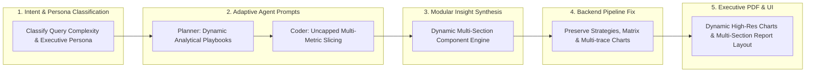

# Implementation Plan: Enhancing Model Output Quality & Analytical Depth

**Document Purpose**: Concrete, step-by-step engineering roadmap to resolve all prompt bottlenecks, architectural oversights, backend component dropping, and rendering limitations identified in [`model_output_quality_analysis.md`](file:///c:/Users/KIIT/Desktop/Nex-Alpha/model_output_quality_analysis.md).

---

## 1. Architectural Architecture & Strategy

To transform Omega from a formulaic 2-sentence summary generator into an executive-grade cognitive analytics platform, we execute five coordinated upgrades:



---

## 2. Detailed Technical Action Items

### Phase 1: Intent & Persona Adaptive Routing (`Omega_Streamlit/src/crew.py`)

#### 1.1. Restore and Fortify Intent Classification
Instead of bypassing `_parse_intent()` and defaulting to `"descriptive"`, introduce an enhanced `_classify_query_context()` helper:
- **Executive / Strategic Persona**: Queries with CEO, strategy, shut down, invest, expand, optimize, prioritize, recommend.
  $\rightarrow$ Intent: `"strategic_decision"` or `"prescriptive"`.
- **Driver / Attribution**: Queries with factors, drivers, affect, impact, influence, relationship, key contributors.
  $\rightarrow$ Intent: `"driver_attribution"` or `"correlation"`.
- **Predictive / Forecasting**: Queries asking for forecast, predict, classify, cluster.
  $\rightarrow$ Intent: `"forecast"`, `"regression"`, `"classification"`.
- **Descriptive / Aggregation**: Simple lookups, averages, counts, distributions.
  $\rightarrow$ Intent: `"aggregation"`, `"distribution"`.

#### 1.2. Pass Intent & Complexity to the Planner
Inject the classified intent into the Planner prompt so that the Planner can choose an appropriate analytical depth rather than defaulting to a 3-step `groupby`.

---

### Phase 2: Planner & Coder Prompt Modernization (`Omega_Streamlit/src/crew.py`)

#### 2.1. Dynamic Analytical Playbooks in `_PLANNER_SYSTEM_PROMPT`
Replace the rigid *"Brevity: 3-4 concise direct steps"* rule with context-adaptive playbooks:
- **For Driver / Attribution Queries** (e.g. *"Which factors highly affect ev_adoption_likelihood"*):
  1. Profile correlations across all numeric features against the target variable.
  2. Compute mutual information or train a quick tree/regression model to extract normalized feature importance rankings.
  3. Calculate grouped statistics on the top 3 drivers (e.g. adoption likelihood across low, medium, and high tiers of EV Knowledge and Income).
  4. Write `query_result.json` with ranked feature impact scores and metrics.
  5. Generate a horizontal bar chart of Top Driver Impact.
- **For Strategic / Executive Decision Queries** (e.g. *"Being the CEO, which city_type to shut down and why?"*):
  1. Compute a comprehensive Multi-Criteria Scorecard across the segments (Customer volume, adoption rate, average income, charging access, growth rate).
  2. Perform trade-off analysis: What is the downside risk vs cost savings of shutting down each option?
  3. Formulate a concrete recommendation backed by at least 3 distinct metrics.
  4. Write `query_result.json` containing the full comparison matrix.

#### 2.2. Remove Artificial Limits from `_CODER_SYSTEM_PROMPT`
- Lift the `< 40-50 lines` limit. Allow clean, vectorised pandas code up to 120 lines when performing multi-factor feature ranking or multi-criteria decision tables.
- Permit the Coder to compute multi-column aggregations (`df.groupby('city_type').agg(...)`) and calculate derived metrics (percentages, ratios, z-scores) directly.

---

### Phase 3: Modular Insight Generation & Abolishing Rigid Templates (`Omega_Streamlit/src/crew.py`)

#### 3.1. Differentiate Insight Prompts by Analytical Tier
Create specialized, rich insight prompts:
1. `_STRATEGIC_DECISION_PROMPT`:
   - **Executive Briefing**: Clear recommendation, rationale, and quantitative justification.
   - **Trade-off Analysis**: What the business loses vs gains.
   - **Actionable Execution Plan**: 3–5 sequenced strategic steps.
   - **Priority Matrix**: Impact, Effort, and Time Horizon.
   - **Risk Assessment & Mitigation**: Concrete operational risks with mitigation strategies.
2. `_DRIVER_ATTRIBUTION_PROMPT`:
   - **Driver Breakdown**: Explains the top positive and negative drivers with statistical grounding.
   - **Actionable Levers**: Which factors can the organization influence (e.g. Education, Charging Stations) vs fixed demographics (e.g. Age).
3. `_DESCRIPTIVE_PROMPT`: Kept clean and focused for straightforward data lookups.

#### 3.2. Eliminate the Invariant 4-Item List Constraint
Remove the few-shot template that forces `[ markdown, metric_grid, table, chart ]`. Instead, allow the LLM to emit the appropriate combination of:
- `markdown` (rich multi-section text with headings)
- `metric_grid` (meaningful multi-card metrics)
- `table` (comprehensive multi-column scorecard)
- `chart` (Plotly specification)
- `strategies` (list of strategic recommendations)
- `priority_matrix` (structured action items with impact and effort)
- `risks` (risk warnings with mitigations)

---

### Phase 4: Backend Pipeline Fixes (`Omega_Streamlit/api/index.py`)

#### 4.1. Fix the Dropped Components Bug (Lines 595–647)
Ensure that `strategies`, `priority_matrix`, and `risks` are **always included in `components`**:
```python
# Preserve strategies, priority_matrix, and risks even when raw_components is provided
strats = final_insight.get("strategies", [])
if strats and not any(c.get("type") == "strategies" for c in components):
    components.append({"type": "strategies", "strategies": strats})

p_matrix = final_insight.get("priority_matrix", [])
if p_matrix and not any(c.get("type") == "priority_matrix" for c in components):
    components.append({"type": "priority_matrix", "priority_matrix": p_matrix})

r_list = final_insight.get("risks", [])
if r_list and not any(c.get("type") == "risks" for c in components):
    components.append({"type": "risks", "risks": r_list})
```

#### 4.2. Upgrade Chart Translation (`convert_plotly_to_recharts`)
- Support multi-trace bar charts (e.g. grouped bars for comparing multiple metrics across categories).
- Preserve axis titles and formatting so the frontend and PDF do not show truncated or distorted charts.

---

### Phase 5: PDF Exporter & Frontend UI Enhancements (`pdfRendererDocument.tsx` & `ChatInterface.tsx`)

#### 5.1. Upgrade `OmegaPDFDocument` in `pdfRendererDocument.tsx`
- **Dynamic Chart Height**: Increase chart height from fixed `160` to `220` points and adjust aspect ratio so x-axis labels are crisp and non-overlapping.
- **Section Structure**: Ensure that when `strategies`, `priority_matrix`, and `risks` are present, they are rendered with clean badges, executive typography, and proper page-break hygiene (`wrap={false}`).
- **Rich Markdown Formatting**: Enhance `parseMarkdownText` to support `##` and `###` subheadings, converting them into distinct PDF section headers instead of flattening them into standard paragraph text.

#### 5.2. Frontend UI Typography (`ChatInterface.tsx`)
- Render markdown blocks using full Markdown formatting (supporting headers, bold text, bulleted lists, and blockquotes) rather than raw `whitespace-pre-wrap`.

---

## 3. Implementation Verification & Testing Plan

### Automated & Manual Verification Steps

| Test Scenario | Input Query | Target Outcome | Verification Criteria |
| :--- | :--- | :--- | :--- |
| **Test 1: Executive Decision** | *"Being the CEO, I have to take a call on shutting down operations in one of the city_type. Which one should it be and why?"* | Multi-Criteria Decision Scorecard | 1. Recommendation backed by $\ge 3$ metrics.<br>2. Full comparative table (not just "Yes/No").<br>3. Strategies, Priority Matrix, and Risks present in output and PDF. |
| **Test 2: Driver Attribution** | *"Which factors highly affect ev_adoption_likelihood"* | Feature Importance & Drivers | 1. Quantitative ranking of factors across all columns.<br>2. Horizontal driver bar chart.<br>3. Plain-language strategic levers for the business. |
| **Test 3: Simple Aggregation** | *"What is the average customer income by city_type?"* | Clean, concise summary | 1. Fast, focused 1-paragraph summary + 1 bar chart.<br>2. No over-engineered fluff. |
| **Test 4: PDF Export Audit** | Click "Export PDF" on Test 1 & 2 | Clean multi-page executive report | 1. Chart height legible ($\ge 200\text{pt}$).<br>2. Strategies, priority matrix, and risks rendered properly.<br>3. No squashed or overlapping text. |

---

## 4. File Modification Scope

- [`Omega_Streamlit/src/crew.py`](file:///c:/Users/KIIT/Desktop/Nex-Alpha/Omega_Streamlit/src/crew.py): Intent classification, Planner playbooks, Coder guidelines, and rich insight prompts.
- [`Omega_Streamlit/api/index.py`](file:///c:/Users/KIIT/Desktop/Nex-Alpha/Omega_Streamlit/api/index.py): Component preservation bug fix, multi-trace chart support.
- [`Omega_Streamlit/utils/pdfRendererDocument.tsx`](file:///c:/Users/KIIT/Desktop/Nex-Alpha/Omega_Streamlit/utils/pdfRendererDocument.tsx): PDF layout, chart sizing, and heading parser.
- [`Omega_Streamlit/components/omega/ChatInterface.tsx`](file:///c:/Users/KIIT/Desktop/Nex-Alpha/Omega_Streamlit/components/omega/ChatInterface.tsx): Rich markdown parsing and styling.
