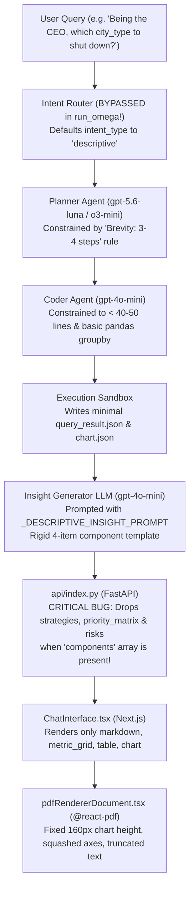

# Deep Analysis: Agent Output Quality, Prompting Bottlenecks, and Rendering Limitations in Omega AI

**Document Purpose**: Comprehensive diagnostic investigation into why the Omega analytics platform produces shallow, formulaic responses (as demonstrated in the attached executive PDF report) and identification of every architectural, prompt-level, backend, and frontend inconsistency preventing full, deep, context-adaptive analysis.

---

## 1. Executive Summary & Observed Output Patterns

An examination of the generated executive reports reveals significant discrepancies between the sophisticated underlying analytical capabilities of Omega and the actual output presented to executive users:

### Key Patterns Observed in the PDF Sample

| Dimension | Observed Behavior in PDF | Expected Executive-Grade Standard |
| :--- | :--- | :--- |
| **Narrative Depth** | **1 to 2 sentences** of shallow summary (e.g., *"This report summarizes the key factors affecting the likelihood of adopting electric vehicles..."*). | Multi-paragraph structured executive brief: Core Finding, Quantitative Evidence, Strategic Trade-offs, and Business Ramifications. |
| **Response Format** | **Strict, invariant template**: Exactly 1 heading $\rightarrow$ 1–2 sentences text $\rightarrow$ 2–3 KPI cards $\rightarrow$ 1 tiny table $\rightarrow$ 1 single bar chart. | Dynamic layout tailored to question complexity: strategic decisions get decision scorecards, trade-off matrices, and risk profiles; simple lookups remain concise. |
| **Analytical Rigor** | **Arbitrary qualitative labels & simplistic counts**: e.g., Table showing *"Rural: Yes, Suburban: No, Urban: No"* or *"EV Knowledge: High, Range Anxiety: Medium"*. No regression coefficients, p-values, feature importance scores, or confidence intervals. | Rigorous statistical grounding: Shapley values, mutual information / correlation coefficients, regression weights, and statistical significance indicators. |
| **Executive Context Handling** | **Persona blindness**: When the user explicitly states *"Being the CEO, I have to take a call on shutting down operations in one of the city_type..."*, the model treats it as a basic row-count grouping query rather than a strategic turnaround scenario. | Multi-Criteria Decision Analysis (MCDA): Revenue at risk, operational cost savings, customer lifetime value (LTV), brand / regulatory risk, and transition roadmap. |
| **Missing Strategic Components** | **Zero strategies, zero priority matrix, zero risk warnings** appear in the PDF report, despite prompt instructions mentioning them. | Dedicated Actionable Strategies section, Effort vs. Impact Priority Matrix, and Operational Risk Mitigation warnings. |

---

## 2. End-to-End Pipeline Breakdown & Root Causes



---

## 3. Detailed Agent & Prompt Bottlenecks

### 3.1. The Intent Router Bypass (Silent Default to `descriptive`)
In [`Omega_Streamlit/src/crew.py`](file:///c:/Users/KIIT/Desktop/Nex-Alpha/Omega_Streamlit/src/crew.py#L645-L654), `_parse_intent()` (which was designed to classify queries into `regression`, `classification`, `prescriptive`, `comparison`, etc.) is **completely bypassed** in `run_omega`:

```python
# Lines 645-653 in src/crew.py
intent_type = "descriptive"
if prediction_data and prediction_data.get("status") in ["regression", "classification", "clustering", "success"]:
    intent_type = prediction_data.get("status")
    if intent_type == "success":
        intent_type = "forecast"
elif "correlation" in user_query.lower() or "test" in user_query.lower():
    intent_type = "correlation"
```

#### Impact:
1. Every query that does not trigger machine learning models or contain the exact substrings `"correlation"` or `"test"` defaults to `"descriptive"`.
2. Even an executive decision query (*"Being the CEO, I have to take a call..."*) is classified as `"descriptive"`.
3. This forces the Insight Generator to select `_DESCRIPTIVE_INSIGHT_PROMPT`:
   > *"You are a senior data analyst and consultant. Your job is to translate descriptive statistics and data profiling results into a clear, jargon-free data health and completeness overview for a non-technical user."*
4. The agent is literally commanded to act as a data profiling tool instead of a business consultant or decision advisor!

---

### 3.2. Planner Agent Artificial Constraints
In [`Omega_Streamlit/src/crew.py`](file:///c:/Users/KIIT/Desktop/Nex-Alpha/Omega_Streamlit/src/crew.py#L376-L409), `_PLANNER_SYSTEM_PROMPT` enforces:

```
CRITICAL RULES:
1. QUERY-INTENT ADAPTIVE SCOPE (DO NOT OVER-ENGINEER):
   - Direct / Aggregation queries: Plan a clean group-by aggregation and 1 primary chart.
   - Diagnostic / Relationship queries: Plan grouped statistical comparisons...
   - Predictive queries: Only plan machine learning if the user explicitly asks to predict, forecast...
2. BREVITY: Keep the execution plan to 3-4 concise, direct steps. Do not plan unnecessary operations or complex custom models when basic statistics directly answer the question.
```

#### Inconsistencies & Limitations:
- **Forced Simplicity**: Instructing the Planner to *"Keep the execution plan to 3-4 concise direct steps"* prevents it from formulating multi-dimensional investigations (e.g. cross-referencing customer counts, revenue per user, charging station access, and satisfaction ratings across city types).
- **Keyword Dependency for ML**: Rule 1 states *"Only plan machine learning if the user explicitly asks to predict, forecast, classify..."*. When the user asks *"Which factors highly affect ev_adoption_likelihood"*, they did not use the word *"predict"*, so the Planner did NOT trigger feature importance or regression. It simply asked the Coder to compute grouped averages on a few arbitrary columns!

---

### 3.3. Coder Agent Line Capping & Tool Underutilization
In [`Omega_Streamlit/src/crew.py`](file:///c:/Users/KIIT/Desktop/Nex-Alpha/Omega_Streamlit/src/crew.py#L411-L449), `_CODER_SYSTEM_PROMPT` states:

```
CRITICAL CODING GUIDELINES:
1. BREVITY & SPEED: Write concise, focused code (under 40-50 lines). Do NOT define custom helper functions or classes. Perform calculations directly on df.
```

#### Inconsistencies & Limitations:
- An analytical script performing multi-factor feature importance, cross-tabulation, outlier filtering, and statistical testing realistically requires 70–120 lines of clean Python.
- Imposing a strict `< 40-50 lines` limit causes the Coder to cut corners, calculating bare minimum single-column aggregations (`df.groupby('city_type').size()`) and writing trivial records (`{"Rural": "Yes", "Suburban": "No", "Urban": "No"}`).
- The pre-injected helpers (`fit_classification_model`, `fit_regression_model`, etc.) are underutilized because the Coder is afraid of exceeding line budgets or generating complex outputs.

---

### 3.4. The Rigid Few-Shot Template in the Insight Prompts
In [`Omega_Streamlit/src/crew.py`](file:///c:/Users/KIIT/Desktop/Nex-Alpha/Omega_Streamlit/src/crew.py#L152-L158), the prompt provides:

```
- "components": A list of layout components to render. Follow this structure:
  [
    {"type": "markdown", "content": "detailed markdown content"},
    {"type": "metric_grid", "metrics": [{"label": "Metric Name", "value": "Metric Value"}]},
    {"type": "table", "headers": ["Col1", "Col2"], "rows": [["Val1", "Val2"]]},
    {"type": "chart", "plotly_spec": {}}
  ]
```

#### Inconsistencies & Limitations:
- The LLM takes `"Follow this structure"` literally as a schema order constraint. It outputs exactly one markdown block, exactly one 2-3 item metric grid, exactly one table, and one chart.
- It never produces deep multi-section markdown (e.g. `### Strategic Context`, `### Risk Analysis`, `### Financial Trade-offs`).
- It forces tables to have 2 columns and 3–5 rows, resulting in synthetic or trivial data tables.

---

## 4. Critical Backend Data Pipeline Bugs (`api/index.py`)

### 4.1. The "Dropped Components" Bug
In [`Omega_Streamlit/api/index.py`](file:///c:/Users/KIIT/Desktop/Nex-Alpha/Omega_Streamlit/api/index.py#L595-L643):

```python
# Build dynamic visual components list
components = []
raw_components = final_insight.get("components", [])

if not raw_components or not isinstance(raw_components, list):
    # Fallback to structured sequence
    components.append({"type": "markdown", "content": answer})
    for c_spec in charts_list:
        components.append({"type": "chart", "spec": c_spec.dict()})
    
    strats = final_insight.get("strategies", [])
    if strats:
        components.append({"type": "strategies", "strategies": strats})
        
    p_matrix = final_insight.get("priority_matrix", [])
    if p_matrix:
        components.append({"type": "priority_matrix", "priority_matrix": p_matrix})
        
    r_list = final_insight.get("risks", [])
    if r_list:
        components.append({"type": "risks", "risks": r_list})
else:
    # When raw_components IS provided:
    for comp in raw_components:
        c_type = comp.get("type", "")
        if c_type == "chart": ...
        elif c_type == "markdown": ...
        elif c_type == "metric_grid": ...
        elif c_type == "table": ...
```

#### The Flaw:
- When the LLM follows the system prompt and populates `components: [...]`, `api/index.py` executes the `else:` branch.
- In this branch, **only `chart`, `markdown`, `metric_grid`, and `table` are parsed**!
- The top-level keys `strategies`, `priority_matrix`, and `risks` that the LLM generated are **silently discarded**!
- That is why **neither the frontend nor the PDF ever showed strategies, priority matrix, or risks**.

---

### 4.2. Truncation to Single-Trace Charts (`convert_plotly_to_recharts`)
In [`Omega_Streamlit/api/index.py`](file:///c:/Users/KIIT/Desktop/Nex-Alpha/Omega_Streamlit/api/index.py#L294-L380):
- The conversion only reads `trace = traces[0]`.
- Grouped bar charts, multi-series line charts, scatter plots with regression trendlines, and dual-axis charts have all secondary traces thrown away.
- As seen in the PDF, this flattens multifaceted visual comparisons into monochromatic, simplistic bar charts.

---

## 5. Frontend & PDF Rendering Limitations

### 5.1. PDF Exporter Card Wrapping & Font Crushing (`pdfRendererDocument.tsx`)
In [`Omega_Streamlit/utils/pdfRendererDocument.tsx`](file:///c:/Users/KIIT/Desktop/Nex-Alpha/Omega_Streamlit/utils/pdfRendererDocument.tsx):
- **Forced Single Callout Card** (Lines 304–314):
  `const isSummary = comp.content.toLowerCase().includes("key insight") || idx === 0;`
  The very first markdown block is always placed into an `Executive Insight Summary` card with small 9.5pt font and gray text. Even if the LLM wrote several paragraphs, it gets shoehorned into a single box.
- **Distorted Chart Height** (Line 209):
  `height: 160, objectFit: "contain"`
  A fixed height of 160 points squashes wide bar charts into tiny, illegible thumbnails with overlapping x-axis labels (clearly visible on both pages of the user's PDF).
- **Arbitrary Table Slicing** (Line 378):
  `comp.rows.slice(0, 15)`
  Hardcoded row slicing without pagination support or dynamic column width balancing.

---

## 6. Summary of Core Flaws & Impact Matrix

| # | Flaw / Bottleneck | Location | Direct Impact on Output |
| :--- | :--- | :--- | :--- |
| **1** | Bypassed Intent Classification | `crew.py:645` | All non-ML queries default to `descriptive` data-health checks, stripping executive context. |
| **2** | Artificial Brevity Mandates | `crew.py:386, 434` | Planner capped at 3-4 steps; Coder capped at 40 lines. Multi-variable analysis is abandoned. |
| **3** | Rigid 4-Component Schema Template | `crew.py:152-158` | LLM mimics the exact 4-item list (markdown, metric, table, chart), producing formulaic outputs. |
| **4** | Backend Drops Rich Components | `api/index.py:616-638` | `strategies`, `priority_matrix`, and `risks` are discarded when `raw_components` is present. |
| **5** | Keyword-Only ML/Analytics Triggering | `crew.py:384` | Queries like *"Which factors affect..."* fail to trigger feature importance or regression. |
| **6** | Single-Trace Chart Demotion | `api/index.py:294` | Recharts converter only takes `traces[0]`, destroying grouped and multi-variable charts. |
| **7** | PDF Fixed Chart Height (160px) | `pdfRendererDocument.tsx:209` | squashed, illegible chart visuals with clipped labels in exported executive reports. |

---

## 7. Next Steps

See the companion document [`implementation_plan_output_enhancement.md`](file:///c:/Users/KIIT/Desktop/Nex-Alpha/implementation_plan_output_enhancement.md) for the complete engineering plan to fix these issues.
