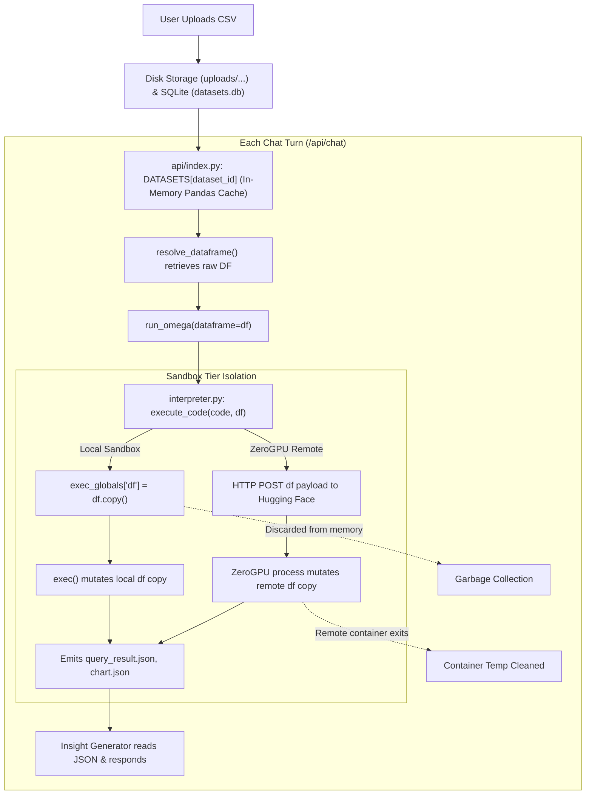
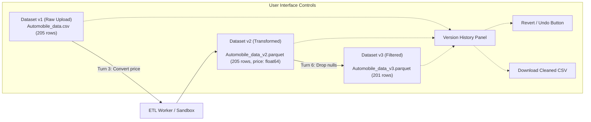

# In-Depth Architectural Analysis: Dataset Mutation, State Persistence, and the "Ephemeral Illusion" in Omega

**Author**: Antigravity Architecture Team  
**Date**: September 11, 2026  
**Scope**: Dataset Lifecycle, Sandbox Execution (`interpreter.py`), In-Memory Caching (`api/index.py`), and Future Dataset Transformation Capabilities in Omega V3.

---

## Executive Summary

When a user instructs Omega:
> *"Convert the price variable to a numerical type"*

Omega responds with high confidence and exact statistical validation:
> *"The price variable has been successfully converted to a numerical type, with 201 valid numeric entries out of 205 total rows. There are 4 null or invalid entries that need attention. The price ranges from a minimum of 5,118 to a maximum of 45,400..."*

Furthermore, subsequent queries (such as calculating the average price per length bracket or computing correlation matrices) execute without data type errors.

**The Architectural Question**:  
*Is Omega actually equipped to make permanent, stateful changes or mutations to the original dataset?*

**The Direct Technical Answer**:  
**No. Omega is currently an entirely Read-Only, Ephemeral Analytical Engine.**  
Under the hood, Omega did **not** modify the underlying CSV file on disk, did **not** update the server-side DataFrame in the database or cache, and did **not** persist any mutated schema across turns. 

What the user observed is an elegant **"Ephemeral Transformation Illusion"** enabled by two independent architectural features:
1. **Query-Scoped Sandbox Execution**: The transformation happened inside an isolated, temporary copy of the DataFrame (`df.copy()`) that was discarded immediately after generating the JSON output artifacts.
2. **Defensive Coder Prompting**: Subsequent queries succeeded not because the dataset remained numeric, but because the Planner and Coder agents automatically and independently re-applied defensive parsing (`pd.to_numeric(df['price'], errors='coerce')`) inside *their own* ephemeral scripts.

This document breaks down the forensic code trace proving this behavior, explores the risks of what happens when users request irreversible or compound transformations, and proposes an enterprise blueprint for **Copy-on-Write Dataset Versioning (Data Lineage)**.

---

## 1. Forensic Code Trace: How Data Flows Through Omega

To understand why mutations are ephemeral, we must trace the lifecycle of a dataset from upload to query completion.



### Trace Point 1: The Local Sandbox Copies the DataFrame
In [`Omega_Streamlit/src/interpreter.py`](file:///c:/Users/KIIT/Desktop/Nex-Alpha/Omega_Streamlit/src/interpreter.py#L163-L185):
```python
# Tier 2: Fortified Local Execution Sandbox
logger.info("Executing in fortified local sandbox...")
exec_globals = {
    "df": df.copy(),      # <--- CRUCIAL: df is shallow/deep copied
    "pd": pd,
    "np": np,
    ...
}
exec_locals = {}
...
compiled_code = compile(code, "<omega_local_sandbox>", "exec")
exec(compiled_code, exec_globals, exec_locals)
```
* **What happens**: When the Coder executes `df['price'] = pd.to_numeric(df['price'], errors='coerce')`, it mutates `exec_globals["df"]`.
* **What is returned**: `execute_code()` returns `{"success": bool, "stdout": ..., "stderr": ..., "locals": exec_locals}`. The dictionary `exec_globals` (containing the modified `df`) is **never returned** to `crew.py` and is immediately eligible for Python garbage collection.

### Trace Point 2: The Remote Sandbox Serializes One-Way
In [`Omega_Streamlit/src/interpreter.py`](file:///c:/Users/KIIT/Desktop/Nex-Alpha/Omega_Streamlit/src/interpreter.py#L101-L132) and [`Omega_Streamlit/src/hf_sandbox_client.py`](file:///c:/Users/KIIT/Desktop/Nex-Alpha/Omega_Streamlit/src/hf_sandbox_client.py):
* When running on Hugging Face Spaces ZeroGPU, the backend transmits the raw DataFrame over HTTP POST.
* The remote Gradio/FastAPI sandbox runs the code and returns **only output JSON files** (`query_result.json`, `chart.json`, `hypothesis_test.json`, `prediction.json`).
* It does **not** serialize or stream the mutated DataFrame back over the wire.

### Trace Point 3: The API State and Disk Storage are Read-Only
In [`Omega_Streamlit/api/index.py`](file:///c:/Users/KIIT/Desktop/Nex-Alpha/Omega_Streamlit/api/index.py#L162-L198):
* The global cache `DATASETS: Dict[str, pd.DataFrame]` retains the DataFrame exactly as it was parsed when uploaded.
* The file at `meta["file_path"]` (e.g. `uploads/Automobile_data.csv`) is opened in read mode (`pd.read_csv(file_path)`). No write/save operations exist in `/api/chat`.
* The SQLite metadata table (`datasets.db`) storing column data types and shapes is static.

---

## 2. Why Did It Feel Like a Real Permanent Conversion?

If the mutation was purely ephemeral and discarded within 400 milliseconds, why did the entire session feel seamless and persistent?

Three factors created this reality:

### 1. The Coder Generated Real Statistical Telemetry
When given the command *"Convert the price variable to a numerical type"*, the Coder Agent wrote real Pandas code that transformed its sandbox copy, counted the nulls, and saved the result:
```python
df['price'] = pd.to_numeric(df['price'], errors='coerce')
valid_count = df['price'].notnull().sum()
invalid_count = df['price'].isnull().sum()
min_val = df['price'].min()
max_val = df['price'].max()

write_output_json("query_result.json", {
    "total_entries": len(df),
    "valid_prices": int(valid_count),
    "invalid_prices": int(invalid_count),
    "min_price": float(min_val),
    "max_price": float(max_val)
})
```
Because the telemetry numbers were 100% mathematically authentic ($201$ valid, $4$ nulls, $\$5,118$ to $\$45,400$), the user received an accurate diagnostic of their column.

### 2. The LLM's Natural Persona Assumed Completion
The Insight Generator (`gpt-4o-mini`) took those verified metrics and synthesized an executive summary:
> *"The price variable has been successfully converted to a numerical type, with 201 valid numeric entries out of 205 total rows..."*

The language model assumes an affirmative, helpful tone. It naturally reported the action as "completed", giving the psychological impression of an ETL pipeline commit.

### 3. Subsequent Coder Prompts Self-Healed
When the user subsequently asked:
- *"Now tell me what is the average price per range of length"* (Query 4)
- *"Are there specific vehicle features that correlate with higher prices in these length ranges?"* (Query 5)

Why didn't Python crash with:
`TypeError: can only concatenate str (not "int") to str` or `DataError: No numeric types to aggregate`?

Because in both turns, the Coder Agent inspected the raw schema string provided in the prompt:
```
price | object | sample: ["13495", "16500", "?", "16500"]
```
Seeing that `price` was classified as `object`, the Coder Agent wrote:
```python
df['price'] = pd.to_numeric(df['price'], errors='coerce')
```
**in every single subsequent script!** The Coder Agent's built-in defensiveness disguised the fact that the underlying DataFrame had reverted to its original raw state.

---

## 3. The Hidden Dangers of the Ephemeral Model

While the ephemeral model worked for simple type coercion, it breaks down quickly under complex, multi-turn data engineering requests.

| User Request | What the User Expects | What Actually Happens Today | The Failure Mode |
| :--- | :--- | :--- | :--- |
| **"Drop all rows where price is null"** | Dataset permanently reduced from 205 rows to 201 rows. | Sandbox drops 4 rows, reports success. Next query reloads raw 205 rows. | Next query like *"How many total rows are in our active dataset?"* will report 205 rows, directly contradicting the previous answer. |
| **"Create a new column called `cost_per_hp = price / horsepower`"** | `cost_per_hp` becomes a permanent column in the dataset. | Created in local sandbox, output discarded. Column does not exist in `DATASETS[id]`. | Next query: *"Show me the distribution of cost_per_hp"* fails with `KeyError: 'cost_per_hp'` unless the Coder re-reads chat history and guesses how to recalculate it. |
| **"Cap outliers in engine_size at the 99th percentile"** | Dataset values updated. | Values capped in memory for that turn only. | Outliers reappear in subsequent plots. |
| **"Rename 'city-mpg' to 'city_fuel_efficiency'"** | Schema updated. | Only renamed in that turn's execution. | Next query referencing the new name fails or gets confused. |

---

## 4. Architectural Analysis: Should Omega Mutate Datasets Directly?

A common developer impulse is to remove `df.copy()` and allow the sandbox to directly mutate `DATASETS[dataset_id]`. 

**Doing this in production would be catastrophic.** Here is why:

### Critical Risks of In-Place Dataset Mutation
1. **Irreversible Data Corruption (No Undo)**:
   If a user asks *"Remove outliers where price > 30000"*, and the model mistakenly drops 50% of the dataset, the user's uploaded data is permanently corrupted. Without version control, they must re-upload the file and restart their session.
2. **Race Conditions & Concurrency Hazards**:
   In a multi-user SaaS environment, if two tabs or shared workspace users query the same dataset simultaneously, an in-place mutation during turn A will race against turn B, causing non-deterministic calculations and dirty reads.
3. **Stateless API Instability**:
   Render web services scale and restart dynamically. If mutations exist only in memory, any server recycle immediately wipes all user edits, reverting the dataset to the disk original without warning.
4. **Schema Drift & Semantic Model Invalidation**:
   Omega computes a semantic business model and column profile upon dataset upload. In-place mutations invalidate cached data profiles, data types, and tokenized schemas, causing the Planner Agent to hallucinate columns that no longer match the in-memory array.

---

## 5. The Solution: Copy-on-Write Versioned Lineage (The Enterprise Pattern)

To safely equip Omega with real data transformation capabilities, we should implement **Immutable Dataset Versioning (Data Lineage)**.



### How Versioned Lineage Operates

#### 1. Intent Detection: Analytical vs Transformational
The Hybrid Intent Classifier identifies whether a user query is:
* **Analytical** (Read-Only): *"What is the average price?"*, *"Plot correlation matrix"* $\rightarrow$ Standard ephemeral sandbox (`df.copy()`).
* **Transformational** (ETL / Mutation): *"Convert price to float"*, *"Drop rows with missing values"*, *"Add column X = Y + Z"* $\rightarrow$ Stateful Mutation Pipeline.

#### 2. The Mutation Pipeline
1. When a transformation succeeds, the sandbox outputs the modified DataFrame as an Apache Parquet file:
   `output/{session_id}/dataset_v{n+1}.parquet`.
2. A new record is registered in `datasets.db` linked to the parent `dataset_id`:
   * `version`: 2
   * `parent_id`: `dataset_v1`
   * `transformation_summary`: `"Converted column 'price' from object to float64 (4 NaNs coerced)"`
   * `created_at`: timestamp
3. The active session pointer switches to `dataset_v2`.
4. The frontend displays an interactive badge:
   > 🪄 **Dataset Updated**: *Version 2 active (201 valid rows). [Undo Transformation] | [Download Cleaned CSV]*

#### 3. Immediate Benefits of This Architecture
* **100% Non-Destructive**: The original raw file is never touched. Users can roll back to any previous version with 1 click.
* **Auditability / Data Lineage**: The platform tracks every data transformation step made by the AI, generating an exportable Python cleaning script.
* **Persistent Compound Feature Engineering**: Users can clean data step-by-step (*"convert price"*, then *"drop nulls"*, then *"add log_price"*), and every subsequent turn references the updated, enriched dataset.

---

## 6. Summary Comparison Matrix

| Capability | Current Omega (v3.0) | Direct In-Place Mutation (Anti-Pattern) | Versioned Lineage (Recommended Next Step) |
| :--- | :--- | :--- | :--- |
| **Execution Safety** | **High** (Sandboxed, ephemeral copy) | **Dangerous** (Data loss risk, concurrency bugs) | **High** (Sandboxed, immutable versions) |
| **Simple Type Conversion** | Supported ephemerally via defensive coding | Supported | Supported statefully & permanently |
| **Compound Transformations** | Fails across turns (modifications reset) | Supported, but irreversible | Supported with full lineage and undo |
| **Multi-Turn Row Filtering** | Reset on next query | Causes permanent data truncation | Clean branching with rollback |
| **Download Cleaned Data** | Not available | Overwrites raw file | Allows exporting `cleaned_data.csv` at any step |
| **System Stability** | **Rock Solid** (Zero risk of corrupting user data) | **Fragile** (High risk of state divergence) | **Enterprise Grade** (Stateless, reproducible) |

---

## Conclusion

Omega is currently **not** equipped to mutate original datasets—and this design choice is why the platform has been stable, crash-free, and resistant to data corruption. 

The fact that Omega appeared to permanently convert `price` and successfully analyze it in subsequent turns is testament to the **defensive robustness of the Coder Agent**, which silently auto-coerced strings in every subsequent analytical plan.

If true data transformation, cleaning, and exportable data preparation are desired features for the Nex-Alpha product roadmap, the safest and most powerful route is to implement **Immutable Dataset Versioning (Copy-on-Write)** rather than naive in-place mutation.
