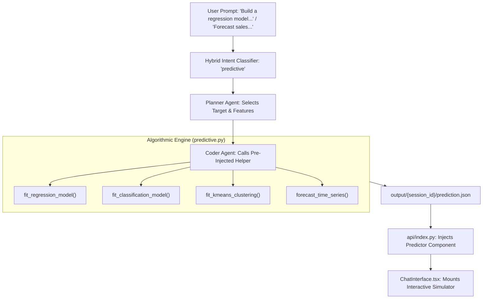

# Deep Architectural Study: Machine Learning, Time-Series Forecasting & UI Presentation in Omega

**Author**: Antigravity Architecture Team  
**Date**: September 11, 2026  
**Scope**: Algorithmic Engine (`predictive.py`), ZeroGPU Execution (`interpreter.py`), Dynamic Simulators (`ChatInterface.tsx`), and UI/PDF Presentation Layers.

---

## Executive Summary

Beyond standard SQL-like aggregations and descriptive statistics, Omega possesses a built-in **Predictive Machine Learning and Time-Series Forecasting Engine**. 

Unlike traditional analytics tools that simply output a static chart or a wall of raw metrics, Omega’s standout architectural innovation is the **Zero-Latency Client-Side "What-If" Simulator**:
When Omega trains a regression or classification model on the server, it does not just compute a prediction; it serializes the **mathematical model weights, intercepts, dummy category encodings, and scaling parameters** into the frontend payload. The browser then renders an interactive React dashboard with sliders and dropdowns, enabling the user to run live scenario simulations at **60 frames per second** with **zero server round-trips**.

This study breaks down:
1. **The Algorithmic Core**: How models are trained, regularized, and evaluated in pure vectorized NumPy/SciPy.
2. **The Agentic Pipeline**: How user intents trigger ML models without hallucination.
3. **UI Presentation & Interactive Widgets**: How regression, classification, and forecasting are visualized in the Web interface.
4. **The Web UI vs. PDF Discrepancy**: Why the PDF export looks different from the web experience.
5. **Limitations & High-Impact Roadmap Upgrades**: What is needed to elevate Omega from GLM models to enterprise-grade AutoML.

---

## 1. The Algorithmic Core: What Models Does Omega Support?

All predictive intelligence resides in [`Omega_Streamlit/src/predictive.py`](file:///c:/Users/KIIT/Desktop/Nex-Alpha/Omega_Streamlit/src/predictive.py) (approx. 1,000 lines of optimized numerical code). 

Omega deliberately avoids heavy, slow frameworks (like heavy PyTorch or TensorFlow runtimes) for standard queries, relying instead on **vectorized NumPy and SciPy algorithms** that execute in **$< 800\text{ms}$** even on datasets with tens of thousands of rows.



### Model Capabilities Breakdown

| Model Type | Algorithm & Implementation | Preprocessing & Encoding | Exported Metrics | UI Component Type |
| :--- | :--- | :--- | :--- | :--- |
| **Multiple Linear Regression** | Ordinary Least Squares (OLS) via QR/SVD factorization | Auto one-hot encoding for categorical variables; standard scaling for numeric features; missing value coercion | $R^2$, Adjusted $R^2$, MAE, RMSE, F-statistic, p-values | `regression_predictor` (What-If Sliders) |
| **Logistic Regression** | Binary & Multiclass (One-vs-Rest) with L2-regularized Cross-Entropy via BFGS optimization (`scipy.optimize.minimize`) | Dynamic target binarization; one-hot encoding for categorical features; z-score standardization | Accuracy, Precision, Recall, Macro F1, Confusion Matrix | `classification_predictor` (Probability Gauge) |
| **Time-Series Forecasting** | Chronological aggregation, seasonal factor decomposition (weekly/monthly/annual), and trend fitting | Auto-frequency detection (`YS`, `MS`, `W`, `D`); chronological sorting; missing value interpolation | $R^2$, Trend Slope, Standard Error of Prediction, 95% Confidence Bounds | `forecast_predictor` (Interactive Horizon) |
| **K-Means Clustering** | Vectorized Lloyd's algorithm with K-Means++ initialization ($k=2 \dots 8$); Dimensionality reduction via SVD/PCA | Z-score normalization; categorical one-hot encoding; downsampling to 50k rows for sub-second convergence | Cluster Centroids, Inertia, Variance Explained (PC1, PC2, PC3) | Rendered as 3D Scatter / Grouped Bar |

---

## 2. The Agentic Pipeline: How Queries Trigger ML

How does a casual user prompt like *"Build a regression model for price based on fuel-type, height, and width"* navigate the pipeline?

### Step 1: Intent Routing (`crew.py`)
In `classify_query_intent()`, regex matching detects keywords like `"predict"`, `"forecast"`, `"regression model"`, `"classification"`, or `"cluster"`. The query is routed to `intent_type: "predictive"`.

### Step 2: Planner Playbook
The Planner Agent is instructed:
> *"Only plan machine learning (fit_regression_model, fit_classification_model, fit_kmeans_clustering) or forecasting (forecast_time_series) if the user explicitly asks to predict, forecast, classify, or cluster."*

The Planner checks the schema, verifies that the target and candidate features exist, and emits:
```xml
<analysis_steps>
1. Call fit_regression_model(df, target_col='price', feature_cols=['fuel-type', 'height', 'width', 'compression-ratio']).
2. Format model summary statistics into query_result.json.
</analysis_steps>
<output_files>
- prediction.json
- query_result.json
</output_files>
```

### Step 3: Coder Invocation
The Coder Agent receives the pre-injected functions in scope and outputs:
```python
res = fit_regression_model(
    df, 
    target_col='price', 
    feature_cols=['fuel-type', 'height', 'width', 'compression-ratio']
)
write_output_json("query_result.json", {
    "status": "success",
    "result_rows": [
        {"Metric": "Mean Absolute Error", "Value": round(res["model_metrics"]["mae"], 2)},
        {"Metric": "Root Mean Squared Error", "Value": round(res["model_metrics"]["rmse"], 2)},
        {"Metric": "R-squared", "Value": round(res["model_metrics"]["r_squared"], 3)}
    ]
})
```

### Step 4: Insight Generation (`gpt-4o-mini`)
The Insight Generator reads `prediction.json`. Instead of describing abstract math, it translates the coefficients into business reality:
> *"The regression model explains approximately 49.7% of the variation in vehicle prices ($R^2 = 0.497$). However, the Mean Absolute Error of $5,046 indicates that vehicle width and compression-ratio alone leave significant unexplained variance. We recommend incorporating engine size and curb weight to improve precision."*

---

## 3. UI Presentation: The Interactive Client-Side Simulators

The core differentiator of Omega is found in [`Omega_Streamlit/components/omega/ChatInterface.tsx`](file:///c:/Users/KIIT/Desktop/Nex-Alpha/Omega_Streamlit/components/omega/ChatInterface.tsx#L105-L405).

Instead of forcing users to submit a new prompt every time they want to test a hypothesis, Omega ships **complete mathematical client-side simulators**:

### A. The Predictive Regression Simulator (`RegressionPredictor`)
* **Visual Presentation**:
  - **Feature Controls**: Each numeric feature is rendered as a clean slider (`SliderInput`) bounded by the dataset’s actual `[min, max]` values, defaulting to the column `mean`. Categorical features are rendered as dropdown selectors (`SelectInput`).
  - **Live Target Card**: Prominently displays the simulated outcome (e.g., `Simulated Price: $18,420.50`) updating continuously as sliders move.
  - **Accuracy Pill**: Shows $R^2$ score (e.g., `R² = 0.4970`).
* **The Mathematics Running in the Browser**:
  $$\hat{Y} = \beta_0 + \sum_{i \in \text{numeric}} \beta_i \left(\frac{X_i - \mu_i}{\sigma_i}\right) + \sum_{j \in \text{categorical}} \beta_{\text{dummy}, j}$$
  The browser recalculates this dot product on every mouse drag event. There is **zero network latency** and zero API cost.

```
+-------------------------------------------------------------------------------+
|  [🎛️ PREDICTIVE REGRESSION SIMULATOR]                          (R² = 0.4970) |
|  Predicting: Price                                                            |
|  Adjust the controls below to calculate predictions dynamically.              |
|                                                                               |
|  [ Fuel Type: [ Diesel        ▼ ] ]     [ Height: 53.70               ]       |
|                                         [ ───────────●──────────────── ]       |
|  [ Width: 65.90                   ]     [ Compression Ratio: 10.10     ]       |
|  [ ────────●──────────────────── ]     [ ──────────────●────────────── ]       |
|                                                                               |
|  +-------------------------------------------------------------------------+  |
|  |                   SIMULATED VEHICLE PRICE                               |  |
|  |                         $16,842.20                                      |  |
|  +-------------------------------------------------------------------------+  |
+-------------------------------------------------------------------------------+
```

---

### B. The Probability Simulator (`ClassificationPredictor`)
* **Visual Presentation**:
  - Sliders and selectors for candidate predictors.
  - A color-shifting progress bar indicating probability (green for positive class, rose for negative class).
  - Metrics header: Displays overall model Accuracy (e.g. `Accuracy: 88.4%`).
* **The Mathematics Running in the Browser**:
  $$z = \beta_0 + \sum \beta_i X_i, \quad P(Y=1) = \frac{1}{1 + e^{-\text{clip}(z, -20, 20)}}$$
  The probability gauge animates smoothly between 0% and 100%, updating the predicted class threshold at $0.5$.

---

### C. The Time-Series Forecast Projection (`ForecastPredictor`)
* **Visual Presentation**:
  - **Recharts Line Chart**: Historical data rendered as a solid blue line; future forecast rendered as a dashed orange line (`connectNulls={true}`).
  - **Interactive Horizon Slider**: Allows the user to dynamically expand or contract the forecast window (e.g. from 3 periods to 12 periods).
  - **Model Health Grid**: Displays $R^2$, current Horizon, Standard Error of Prediction, and an automated badge (`High Accuracy`, `Moderate Accuracy`, or `Low Accuracy`).

---

## 4. The Web UI vs. PDF Discrepancy: Why Does the PDF Look Different?

In the user's exported PDF report (Page 2), the regression query yielded:
* An executive narrative paragraph.
* A static `DATA RECORDS` table containing `Mean Absolute Error`, `Root Mean Squared Error`, and `R-squared`.
* **The interactive slider simulator was absent.**

### Why This Happens:
1. **React-PDF Execution Constraints**:
   [`pdfRendererDocument.tsx`](file:///c:/Users/KIIT/Desktop/Nex-Alpha/Omega_Streamlit/utils/pdfRendererDocument.tsx) compiles PDF binary streams on the client side using `@react-pdf/renderer`. It only supports static layout primitives (`<View>`, `<Text>`, `<Image>`). It cannot execute client-side state (`useState`), mouse events (`onChange`), or interactive sliders.
2. **Fallback Logic**:
   In `pdfRendererDocument.tsx` line 473, unhandled components gracefully return `null`.
   Because `regression_predictor` returns `null`, the PDF engine displays the companion table (`query_result.json`) instead.

---

## 5. Architectural Strengths & Key Gaps

### What Omega Does Brilliantly Today:
1. **Blazing Execution Speed**: Pure NumPy/SciPy execution completes in $<800\text{ms}$, keeping Omega well under Render's 100-second proxy timeout.
2. **Zero-Latency Client-Side Inference**: Exporting model weights to the browser eliminates the server cost of running what-if scenarios.
3. **Data Safety**: Missing values, categorical string coercion, and high-cardinality limits are handled automatically without throwing Python exceptions.

### Key Gaps & Strategic Upgrade Opportunities:

```
+---------------------------+---------------------------------------+---------------------------------------+
| CAPABILITY                | CURRENT STATE (v3.0)                  | TARGET ENTERPRISE UPGRADE             |
+---------------------------+---------------------------------------+---------------------------------------+
| Modeling Algorithms       | Linear/Logistic OLS + K-Means         | LightGBM / XGBoost & Random Forest    |
| Non-Linear Relationships  | Approximated via log/polynomial       | Gradient Boosted Decision Trees       |
| Multicollinearity Defense | Basic correlation checks              | Variance Inflation Factor (VIF) auto- |
|                           |                                       | pruning & Ridge/Lasso regularization  |
| Time-Series Modeling      | Seasonal Linear Trend Decomposition   | AutoARIMA & Facebook Prophet          |
| PDF Report Integration    | Falls back to metric table            | Static "Model Coefficients Card" with |
|                           |                                       | visual feature importance bars in PDF |
+---------------------------+---------------------------------------+---------------------------------------+
```

---

## 6. Recommendations for the Product Roadmap

If we want to elevate Omega’s ML experience to the next tier:

1. **Static Model Summary in PDF**:
   Add a dedicated renderer in `pdfRendererDocument.tsx` for `comp.type === "regression_predictor"` that draws a clean, non-interactive **Feature Importance / Coefficient Bar Chart** so PDF readers get the full picture.
2. **Feature Contribution (SHAP-Lite) in UI**:
   Alongside the simulated price, show which single feature contributed the most positive and negative delta to the simulated outcome.
3. **Tree-Based Ensembles (Optional ZeroGPU Mode)**:
   For complex datasets, leverage the Hugging Face Spaces ZeroGPU container to train a LightGBM regressor when linear models yield $R^2 < 0.4$.

---

## Conclusion

Omega’s ML and Forecasting architecture is **lean, mathematically sound, and exceptionally fast**. By combining server-side NumPy fitting with client-side React parameter simulation, it delivers a **playful, tactile data exploration experience** that standard static dashboards cannot match.
