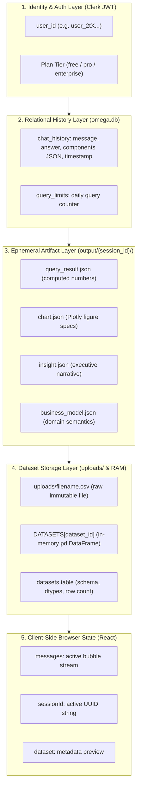

# Omega Session Architecture: The What, How, and Why of User Session Storage

**Author**: Antigravity Architecture Team  
**Date**: September 11, 2026  
**Scope**: Full-Stack State Management, Concurrency Isolation, Database Persistence, and Session Lifecycle across Nex-Alpha & Omega V3.

---

## Executive Overview

In modern AI analytics platforms, the term **"session"** is frequently misunderstood as merely a browser cookie or an authentication token. 

In **Omega**, a session represents a **multi-tiered state boundary**. It is the connective tissue that links an authenticated user, an uploaded dataset, a sequence of analytical questions, generated visual artifacts (Plotly charts, metrics, scorecards), and SaaS billing limits.

Without this session architecture, Omega would either be a completely stateless one-shot chatbot (forgetting previous queries, unable to export multi-page executive PDFs) or a broken multi-tenant system where simultaneous queries from different users would overwrite each other's charts and data.

This document breaks down the **What**, **How**, and **Why** of Omega's session architecture with exact code traces across the frontend and backend.

---

## 1. WHAT Does Omega Store About a User Session?

Omega partitions session data across **5 distinct layers**:



### Breakdown of the 5 Layers:

| Layer | What is Stored | Format / Type | Storage Location | Sensitivity |
| :--- | :--- | :--- | :--- | :--- |
| **1. Identity & Auth** | `user_id` (`sub`), user email, workspace tier (`free`/`pro`), JWT expiry | Cryptographic JWT Token | Browser Cookie / Memory $\rightarrow$ verified by FastAPI | High (Security) |
| **2. Relational History** | User prompts, AI responses, rendered UI components list, timestamps | SQLite Rows | Server disk: `Omega_Streamlit/api/omega.db` | Medium (User Data) |
| **3. Ephemeral Artifacts** | `query_result.json`, `chart.json`, `insight.json`, `business_model.json` | JSON Files | Server disk: `output/{session_id}/` | Low (Regenerable) |
| **4. Dataset Storage** | Raw CSV/Excel file, in-memory DataFrame, schema column types, row counts | File + RAM + SQLite | `uploads/`, `DATASETS` cache, `datasets` table | High (User Data) |
| **5. Metering / Limits** | Daily query count per user per date (`query_count`) | SQLite Row | `omega.db` (`query_limits` table) | Medium (Billing) |

---

## 2. HOW Does Omega Store and Manage Sessions?

Omega uses a hybrid storage model combining **Client-Side Identity**, **Relational Persistence (SQLite)**, **Filesystem Scoping (ContextVars)**, and **In-Memory RAM Caching**.

### A. The Generation of `session_id`
When a user opens the chat interface:
1. The frontend checks if an existing `session_id` was selected from the history sidebar.
2. If none exists, the first message sent to `/api/chat` sends `session_id: null`.
3. In [`api/index.py`](file:///c:/Users/KIIT/Desktop/Nex-Alpha/Omega_Streamlit/api/index.py#L562):
   ```python
   session_id = req.session_id or str(uuid.uuid4())
   ```
   The server mints a unique UUID v4 (e.g. `9b1deb4d-3b7d-4bad-9bdd-2b0d7b3dcb6d`) and returns it in the response payload.
4. The React frontend saves this into state:
   ```typescript
   if (!sessionId) setSessionId(data.session_id);
   ```
   All subsequent prompts in that conversation pass this same `session_id`.

---

### B. Concurrency Isolation via Python `ContextVars`
In a multi-user SaaS platform, if Alice and Bob query Omega at the same second, how does Omega prevent Alice's generated `chart.json` from overwriting Bob's `chart.json`?

Omega solves this using Python's thread-safe **`contextvars`** pattern in [`src/utils.py`](file:///c:/Users/KIIT/Desktop/Nex-Alpha/Omega_Streamlit/src/utils.py#L26-L43):
```python
# ContextVar to isolate output directory per request thread/task
session_output_dir = contextvars.ContextVar("session_output_dir", default=None)

def get_output_path(filename: str) -> str:
    active_dir = session_output_dir.get()
    if active_dir:
        path = Path(active_dir)
    else:
        path = _OUTPUT_DIR
    path.mkdir(parents=True, exist_ok=True)
    return str(path / filename)
```

In [`api/index.py`](file:///c:/Users/KIIT/Desktop/Nex-Alpha/Omega_Streamlit/api/index.py#L564-L566):
```python
# Create an isolated sandbox folder: output/<session_id>/
session_dir = os.path.join(PROJECT_ROOT, "output", session_id)
token = session_output_dir.set(session_dir)

try:
    final_insight = run_omega(...)
finally:
    # Reset ContextVar after request terminates
    session_output_dir.reset(token)
```
* **Result**: Every tool, Coder script, and chart builder executing inside `run_omega()` writes strictly to `output/<session_id>/`. There is zero chance of tenant cross-talk.

---

### C. Relational Persistence in SQLite (`omega.db`)
In [`api/database.py`](file:///c:/Users/KIIT/Desktop/Nex-Alpha/Omega_Streamlit/api/database.py#L18-L55), Omega initializes a lightweight, high-performance SQLite database:

```sql
-- Chat History Table
CREATE TABLE IF NOT EXISTS chat_history (
    id INTEGER PRIMARY KEY AUTOINCREMENT,
    user_id TEXT NOT NULL,
    session_id TEXT NOT NULL,
    dataset_id TEXT NOT NULL,
    message TEXT NOT NULL,
    answer TEXT NOT NULL,
    components TEXT NOT NULL, -- JSON string of visual components (charts, tables, KPIs)
    created_at TEXT NOT NULL
);

-- Daily Limits Table
CREATE TABLE IF NOT EXISTS query_limits (
    user_id TEXT NOT NULL,
    query_date TEXT NOT NULL,
    query_count INTEGER DEFAULT 0,
    PRIMARY KEY (user_id, query_date)
);

-- Persistent Datasets Table
CREATE TABLE IF NOT EXISTS datasets (
    id TEXT PRIMARY KEY,
    filename TEXT NOT NULL,
    file_path TEXT NOT NULL,
    row_count INTEGER NOT NULL,
    columns TEXT NOT NULL,
    dtypes TEXT NOT NULL,
    created_at TEXT NOT NULL
);
```

When each turn finishes:
```python
log_chat(user_id, session_id, req.dataset_id, req.message, answer, components)
```
This writes the user's prompt, the AI's textual answer, and the complete JSON structure of the charts, tables, and KPIs directly into `chat_history`.

---

### D. In-Memory RAM Caching (`DATASETS`)
Parsing a 50MB CSV or Excel file on every single chat prompt would take 2–5 seconds of pure disk I/O.

In [`api/index.py`](file:///c:/Users/KIIT/Desktop/Nex-Alpha/Omega_Streamlit/api/index.py#L158-L198):
```python
DATASETS: Dict[str, pd.DataFrame] = {}

def resolve_dataframe(dataset_id: str) -> Optional[pd.DataFrame]:
    # 1. Fast path: Return from RAM cache in 0.0001ms
    if dataset_id in DATASETS:
        return DATASETS[dataset_id]
        
    # 2. Cold path: Load from disk uploads/ folder and hydrate RAM
    meta = get_persistent_dataset(dataset_id)
    df = pd.read_csv(meta["file_path"])
    DATASETS[dataset_id] = df
    return df
```
* **First Query**: Cold load from disk ($~200\text{ms}$).
* **Subsequent Queries in Session**: Instant in-memory RAM reference ($<0.1\text{ms}$).

---

### E. Frontend Session Restoration (The Sidebar)
In [`components/omega/Sidebar.tsx`](file:///c:/Users/KIIT/Desktop/Nex-Alpha/Omega_Streamlit/components/omega/Sidebar.tsx):
1. When the user opens the platform, the sidebar calls `GET /api/chat/sessions`.
2. The server runs:
   ```sql
   SELECT DISTINCT session_id, dataset_id, MAX(created_at) as last_activity
   FROM chat_history WHERE user_id = ?
   GROUP BY session_id ORDER BY last_activity DESC;
   ```
3. The sidebar renders a list of past sessions with timestamps.
4. When the user clicks a past session:
   - The frontend calls `GET /api/chat/history?session_id=<id>`.
   - The full conversation (including all Recharts graphs, markdown analyses, and data tables) is restored onto the screen in milliseconds.

---

## 3. WHY Does Omega Store Sessions? (The 5 Core Drivers)

| Driver | Why It Is Crucial | What Happens Without It |
| :--- | :--- | :--- |
| **1. Multi-Tenant Safety** | Guarantees that concurrent users on the platform never collide or see each other's data. | User A's correlation chart would appear on User B's screen. |
| **2. Multi-Turn Continuity** | Allows the Planner Agent to know what was previously discussed (e.g. knowing what *"those length ranges"* referred to). | The model would have total amnesia on every single turn. |
| **3. Executive PDF Compilation** | The PDF engine iterates through the entire session history to generate an end-to-end consulting dossier. | The user could only download a PDF of their single latest question. |
| **4. Performance & Responsiveness** | In-memory RAM caching prevents constant disk thrashing and re-parsing of raw files. | Total query latency would spike by 3–8 seconds per prompt. |
| **5. SaaS Usage & Monetization** | Enforces tier policies (e.g. 5 queries/day for free users, unlimited for Pro) tied to the user's account. | Users could bypass limits by opening an incognito window or refreshing. |

---

## 4. Lifecycle & Retention: What Happens When...

### Scenario A: The User Refreshes the Browser or Closes the Tab
* **Identity**: Clerk preserves the session via encrypted cookies/localStorage.
* **History**: Unaffected. Stored permanently in `omega.db`.
* **Dataset**: Persisted in SQLite and on disk in `uploads/`.
* **Behavior on Reopen**: The user clicks the session in the sidebar, and the entire chat re-hydrates instantly.

### Scenario B: The Render Backend Service Restarts / Redeploys
* **In-Memory RAM (`DATASETS`)**: Flushed to zero.
* **Persistent Disk (`uploads/` & `omega.db`)**: Retained on Render persistent disk.
* **Behavior on Next Prompt**: The first subsequent query triggers `resolve_dataframe()`, which silently re-hydrates `DATASETS[dataset_id]` from the `uploads/` folder. The user experiences zero interruption.

### Scenario C: The User Clicks "New Session"
* In [`pages/index.tsx`](file:///c:/Users/KIIT/Desktop/Nex-Alpha/Omega_Streamlit/pages/index.tsx#L46-L49):
  ```typescript
  const handleNewSession = () => {
    setDataset(null);
    setActiveSessionId(null);
  };
  ```
* Clears active React state.
* The previous session remains archived in the sidebar for future reference.
* The next prompt initiates a fresh `session_id` and a brand new isolated `output/{new_session_id}/` folder.

---

## 5. Architectural Summary Table

```
+----------------------------------------------------------------------------------------------------+
|                                    OMEGA SESSION ARCHITECTURE                                      |
+----------------------+--------------------------+---------------------+----------------------------+
| COMPONENT            | STORAGE MEDIUM           | LIFETIME            | PRIMARY RESPONSIBILITY     |
+----------------------+--------------------------+---------------------+----------------------------+
| Clerk Auth JWT       | HttpOnly Cookie / Header | 7 Days (Configurable| User Identity & Tier       |
| SQLite chat_history  | api/omega.db             | Permanent           | Conversational Memory & UI |
| SQLite query_limits  | api/omega.db             | Daily (per date)    | SaaS Limit Enforcement     |
| SQLite datasets      | api/omega.db             | Permanent           | Dataset Schema Catalog     |
| Raw Data Files       | uploads/<id>.<ext>       | Permanent           | Source of Truth for Data   |
| In-Memory DataFrames | api/index.py DATASETS    | Server Process Life | Sub-millisecond Analytics  |
| Artifact Sandbox     | output/<session_id>/     | Session / Request   | Tenant Isolation & Plots   |
| React State          | Browser Memory           | Tab / Window Life   | Interactive Rendering & UI |
+----------------------+--------------------------+---------------------+----------------------------+
```

## Conclusion

Omega stores session state not to track personal user behavior, but to solve **the fundamental challenges of an enterprise data platform**:
1. **Security**: Preventing users from seeing or overwriting each other's data.
2. **Speed**: Keeping massive datasets hot in memory for instantaneous Python sandbox execution.
3. **Continuity**: Enabling rich multi-turn consulting dialogues that can be resumed at any time or exported into board-ready executive PDFs.
